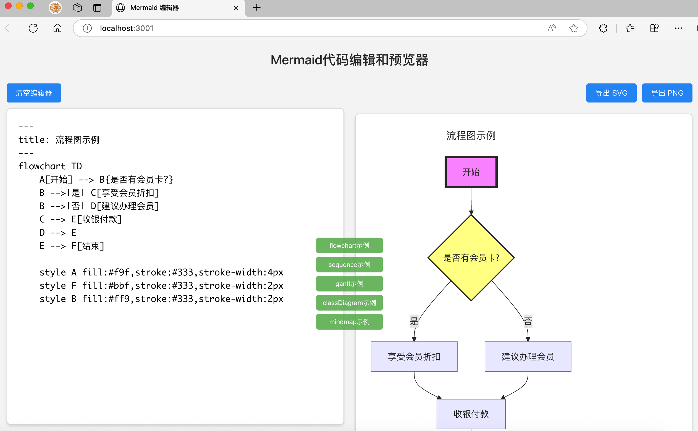

# Mermaid 图表编辑器

一个简单易用的在线 Mermaid 图表编辑器，支持实时预览和多种图表类型。



## 功能特点

- 实时编辑和预览
- 支持多种图表类型：
  - 流程图 (Flowchart)
  - 时序图 (Sequence Diagram)
  - 甘特图 (Gantt)
  - 类图 (Class Diagram)
  - 思维导图 (Mindmap)
- 导出功能：
  - SVG 格式（矢量图）
  - PNG 格式（高清位图）
- 内置示例模板
- 语法错误提示
- 响应式设计

## 详细使用说明

### 1. 编辑器界面


1. 顶部标题栏
2. 左侧代码编辑区
3. 右侧实时预览区
4. 示例按钮组
5. 导出按钮
6. 错误提示区域

### 2. 图表类型示例

#### 流程图 (Flowchart)


#### 时序图 (Sequence Diagram)


#### 甘特图 (Gantt)


#### 类图 (Class Diagram)


#### 思维导图 (Mindmap)


### 3. 快捷操作

- **清空编辑器**：点击左上角"清空编辑器"按钮
- **插入示例**：点击中间的示例按钮
- **导出图表**：
  - SVG格式：适合用于网页或需要缩放的场景
  - PNG格式：适合用于文档或演示

### 4. 错误处理

- 语法错误会实时显示在编辑器上方
- 错误提示包含具体的错误信息，帮助快速定位问题

## 快速开始

1. 克隆项目
```bash
git clone https://github.com/ccbsdu/mermaid-editor.git
cd mermaid-editor
```

2. 安装依赖
```bash
npm install
```

3. 启动开发服务器
```bash
npm start
```

4. 在浏览器中访问 `http://localhost:3000`

## 技术栈

- React 18
- Styled Components
- Mermaid.js 10.0+

## 开发说明

### 项目结构
```
mermaid-editor/
├── src/
│   ├── components/
│   │   └── Mermaid.js
│   ├── App.js
│   └── index.js
├── public/
│   └── index.html
└── package.json
```

### 主要功能实现

1. **实时预览**：使用 Mermaid.js 的实时渲染功能
2. **错误检测**：通过 mermaid.parse() 进行语法验证
3. **导出功能**：支持 SVG 和 PNG 两种格式
4. **响应式设计**：适配不同屏幕尺寸

## 许可证

MIT License

## 贡献指南

1. Fork 项目
2. 创建特性分支 (`git checkout -b feature/AmazingFeature`)
3. 提交改动 (`git commit -m 'Add some AmazingFeature'`)
4. 推送到分支 (`git push origin feature/AmazingFeature`)
5. 提交 Pull Request

```


